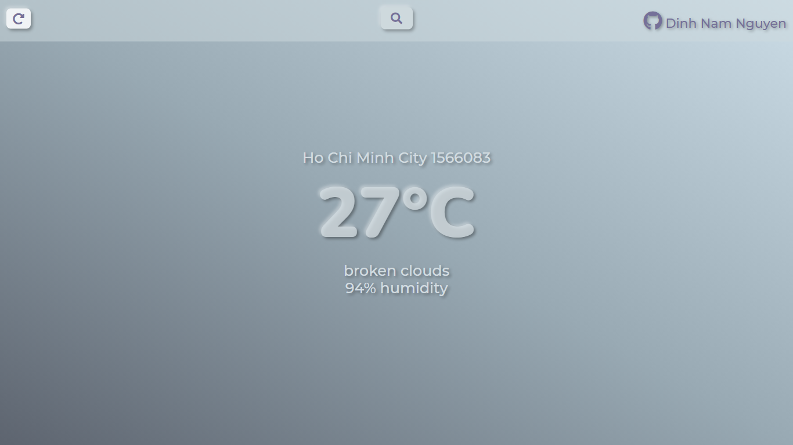
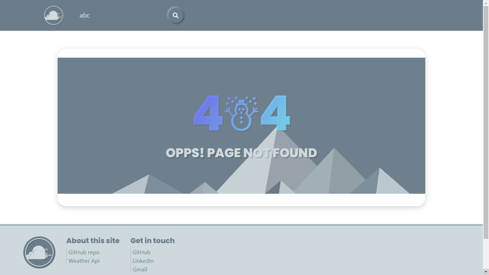

# </img> ReactJS Weather app

### **[→ View site](https://weathernowreact.netlify.app)**

## Preview
  

## Features
  - Input country or city name to get weather info.
  - Use [OpenWeather API](https://openweathermap.org/api) to get weather info.
  - Detailed temperature, humidity, air quality info, etc. are shown with 5 days forecast.

 

